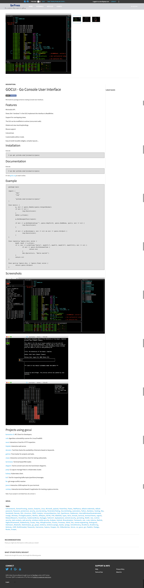
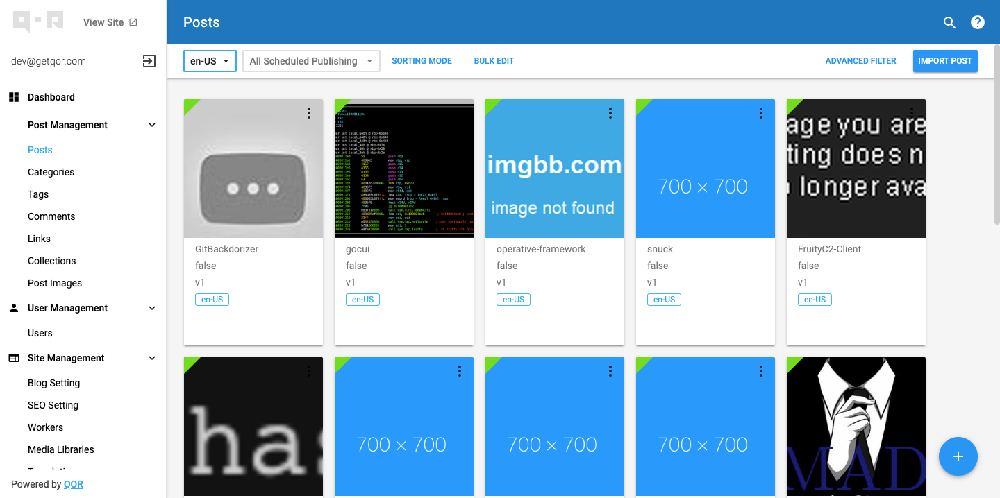
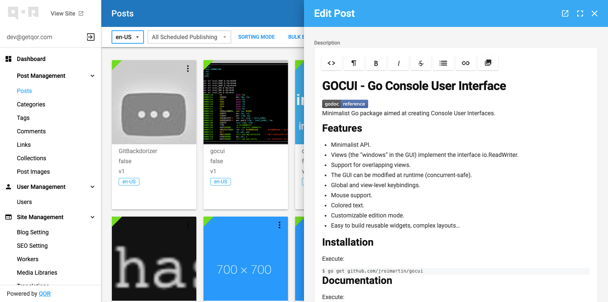
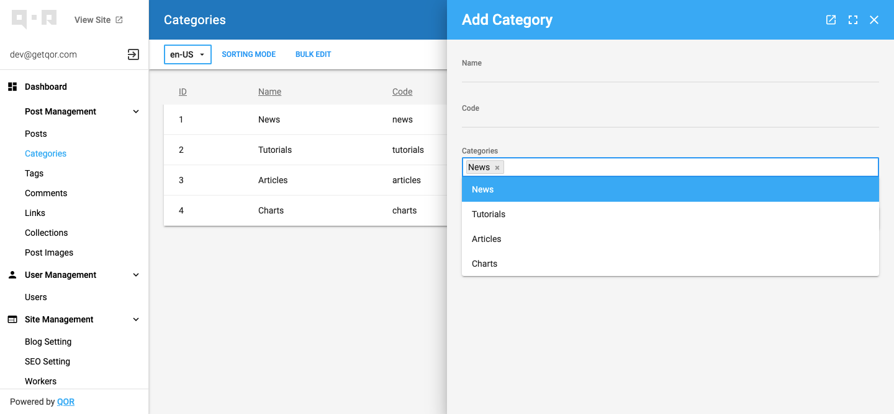

# QorPress example application

This is an example application to show and explain features of [QOR](http://getqor.com).

Chat Room: [](https://gitter.im/qor/qor?utm_source=badge&utm_medium=badge&utm_campaign=pr-badge&utm_content=badge)

## Quick Started

### Locally

#### Go version: 1.8+

```shell
# Get example app
$ go get -ugithub.com/qorpress/qorpress

# Setup database
$ mysql -uroot -p
mysql> CREATE DATABASE qor_example;

# Run Application
$ cd $GOPATH/src/github.com/qorpress/qorpress
$ go run --mod=mod main.go
```

### With Docker

#### Docker version: 

```shell
docker-compose up --build
```

### Generate sample data

based on lorem ipsum texts and fake images
```go
$ go run -mod=mod cmd/lorem/*.go
```

or from kitploit website dump

```go
$ go run -mod=mod cmd/kitploit/*.go
```

### Run tests (Pending)

```
$ go test $(go list ./... | grep -v /vendor/ | grep  -v /db/)
```

## Admin Management Interface

[Qor Example admin configuration](https://github.com/qorpress/qorpress/blob/master/config/admin/admin.go)

## RESTful API

[QorPress Example API configuration](https://github.com/qorpress/qorpress/blob/master/config/api/api.go)

Online Example APIs:

* Users: [http://demo.getqor.com/api/users.json](http://demo.getqor.com/api/users.json)
* User 1: [http://demo.getqor.com/api/users/1.json](http://demo.getqor.com/api/users/1.json)
* Posts: [http://demo.getqor.com/api/posts.json](http://demo.getqor.com/api/posts.json)

## Screenshots

### Frontend
#### full post page


### Backend
#### post manager

#### posts edition

#### categories manager



## License

Released under the MIT License.

[@QORSDK](https://twitter.com/qorsdk)
